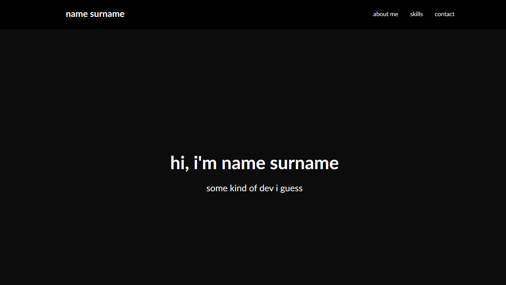
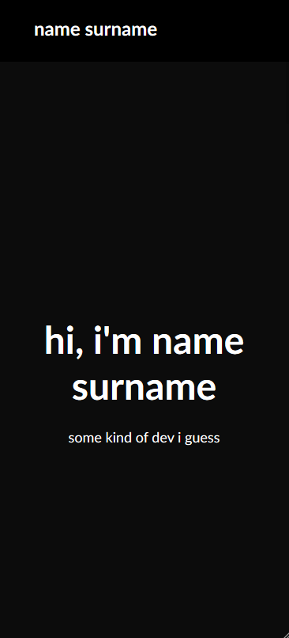
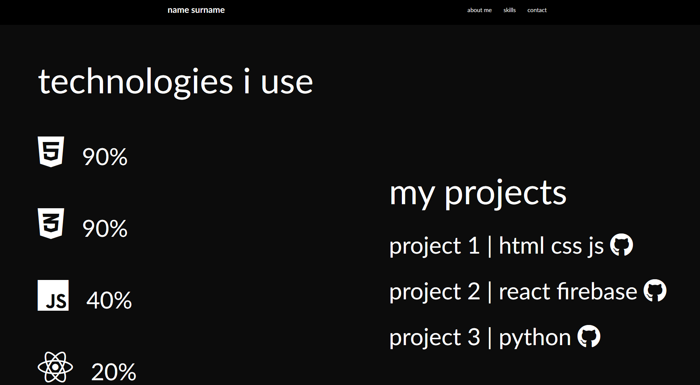
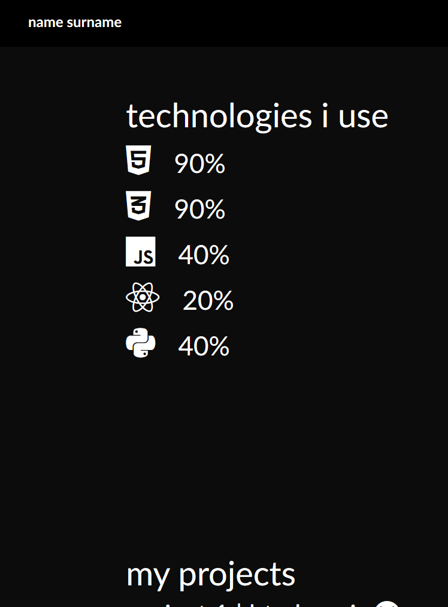
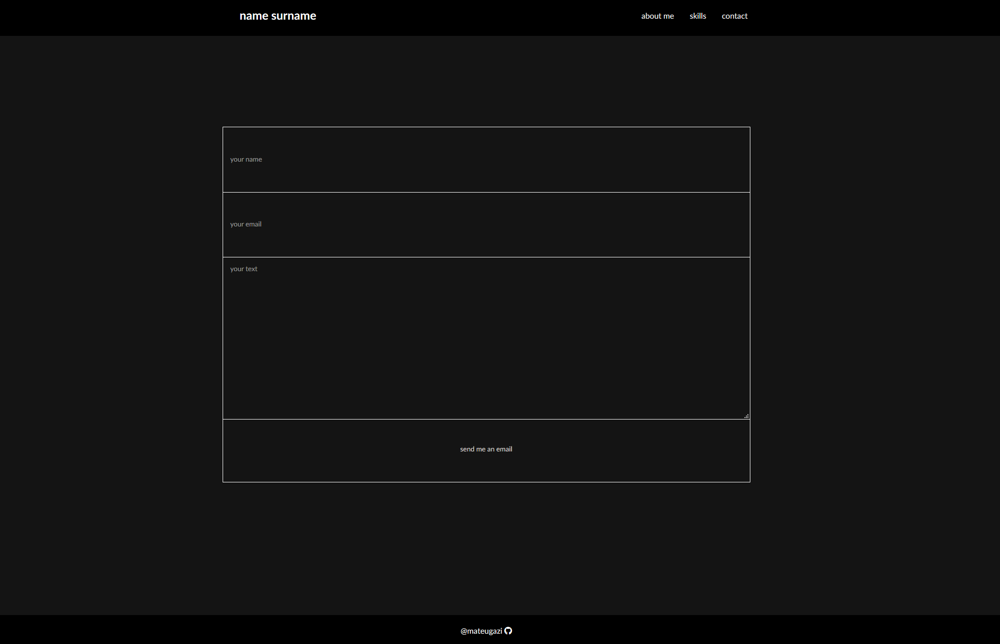
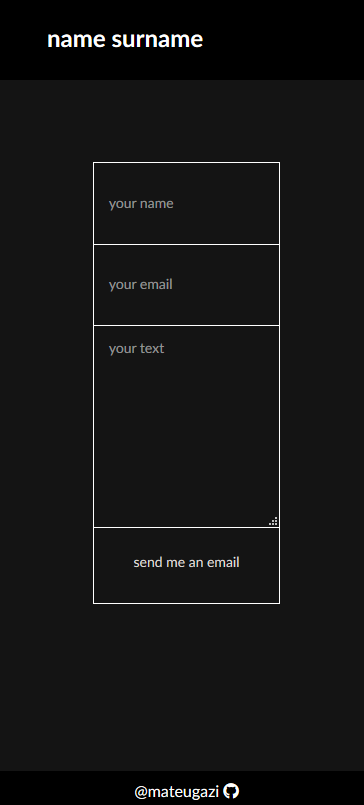

# Portfolio website
Simple portfolio created with the plain HTML and CSS in the form of the static web page.
Demo: https://mateugazi.github.io/CodersCamp_Project_1/

---

This web page is divided into five sections:
* **welcome** section with the greeting from the owner
* **about me** section with the picture of the owner and with the short bio
* **skills** section with the skills of the owner and with the projects 
* **contact** section with the form to contact the owner
* **footer** with the author of this page and his github link

---

Technologies used:
HTML 5
CSS 3
Font Awesome

---

This project includes following conceptions:
* Responsive media querries:

* Responsive grids:

* Responsive contact form:

* Key frames animations when hovering the menu links
